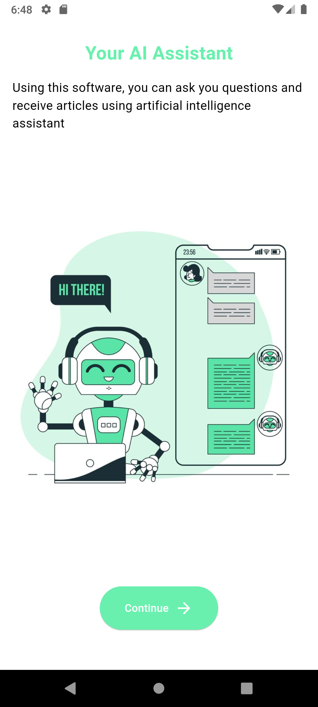
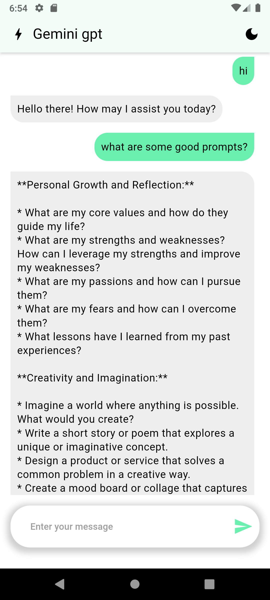
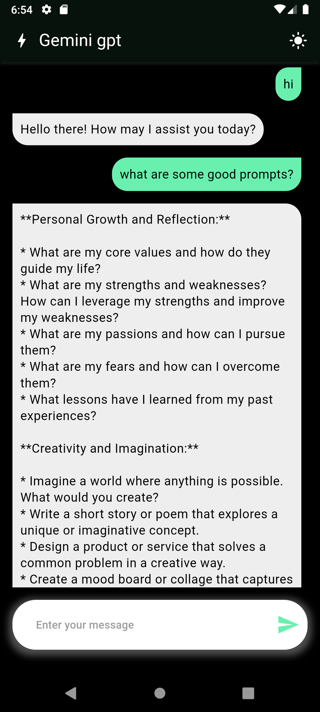

# Gemini GPT Chat App

This is a simple Flutter application that integrates Gemini Generative AI to create a chat interface. The app uses Riverpod for state management and supports both dark and light modes.

## Features
Chat Interface: Communicate with Gemini Generative AI.
State Management: Utilizes Riverpod for efficient state management.
Dark and Light Modes: Toggle between dark and light themes for be

## screenshots

  
